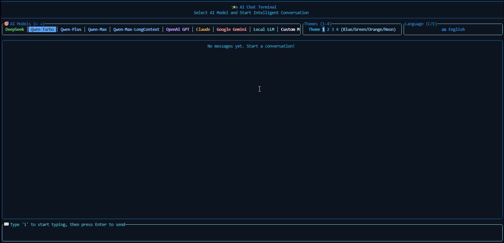
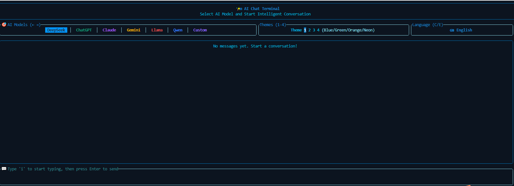
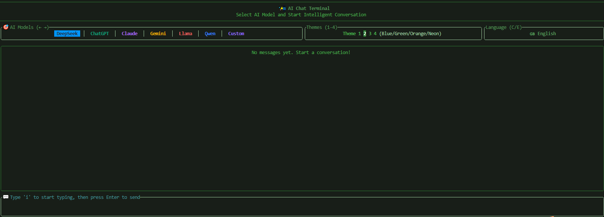
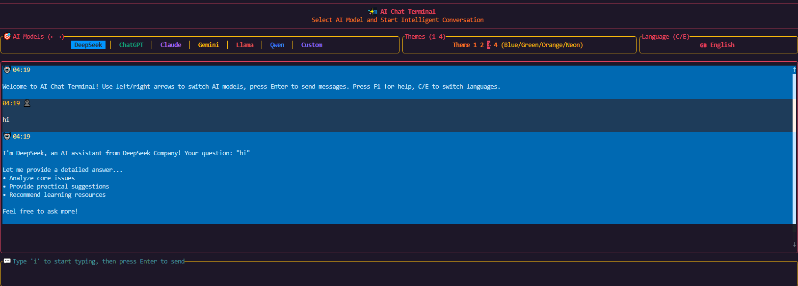
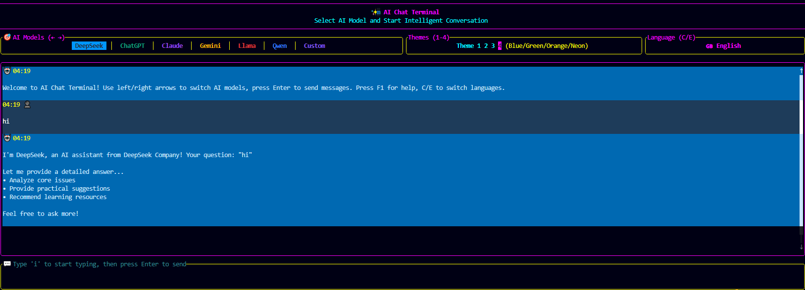

<h1 align="center">aichat</h1>
<h4 align="center">
a terminal-based AI chat application, created purely for fun. by <a href="https://github.com/ratatui/ratatui">ratatui</a>
</h4>

  

<a href="./README_zh-CN.md">简体中文</a> | <a href="./README.md">English</a>

# Demo

# HotKey

## General Hotkeys

- `Enter` - Start chat/Send message
- `F1` - Show/Hide help
- `C` - Switch to Chinese
- `E` - Switch to English
- `1-4` - Switch themes
- `Q` - Quit app

## Chat Navigation

- `← →` - Switch AI models
- `↑ ↓` - Scroll chat history
- `PageUp/Down` - Fast scroll
- `Home/End` - Jump to top/bottom

## Edit Mode

- `i` - Enter edit mode
- `Esc` - Exit edit mode
- `Backspace` - Delete character
- `Delete` - Clear input

# Theme

<table>
  <tr>
    <td align="left">
    <h4>Blue</h4>
    </td>
    <td align="left">
    <h4>Green</h4>
    </td>
    <td align="left">
    <h4>Orange</h4>
    </td>
    <td align="left">
    <h4>Neon</h4>
    </td>
  </tr>
  <tr>
    <td align="center"></td>
    <td align="center"></td>
    <td align="center"></td>
    <td align="center"></td>
  </tr>
</table>
